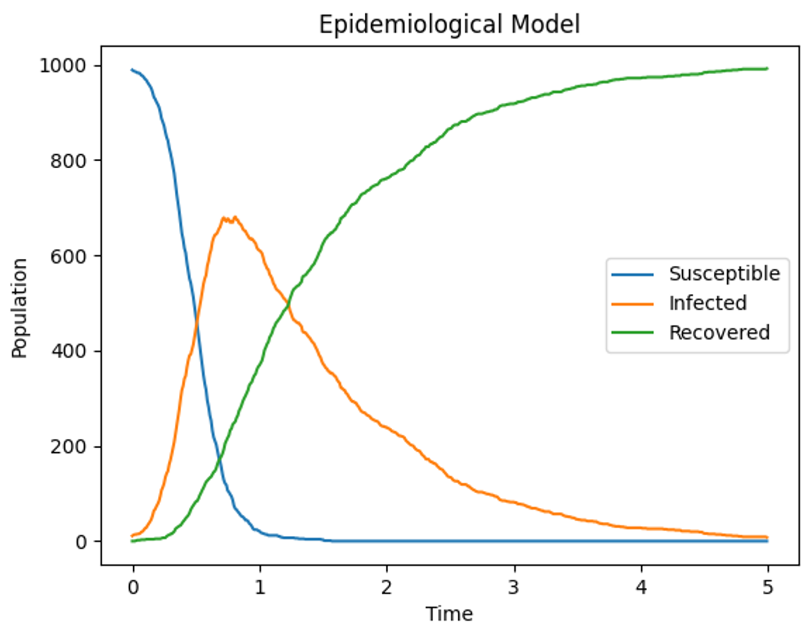

# Epidemiological Model

This project provides a simulation of an epidemiological model, allowing users to study the dynamics of infectious diseases within a population.

## Table of Contents

- [Introduction](#introduction)
- [Features](#features)
- [Getting Started](#getting-started)
  - [Prerequisites](#prerequisites)
  - [Installation](#installation)
- [Usage](#usage)
- [Example](#example)
- [Continuous Integration and Deployment (CI/CD)](#continuous-integration-and-deployment-cicd)
- [Docker](#docker)
  - [Building the Docker Image](#building-the-docker-image)
  - [Running the Docker Container](#running-the-docker-container)
  - [Interacting with the Container](#interacting-with-the-container)
  - [Additional Docker Commands](#additional-docker-commands)
- [License](#license)
- [Author](#Author)

## Introduction

The Epidemiological Model simulation is a Python-based tool designed to simulate and study the spread of infectious diseases within a population. The primary objective is to provide researchers, epidemiologists, and students with a flexible and customizable platform to explore the dynamics of epidemics.

### Problem to Solve

In the context of the COVID-19 pandemic and other infectious diseases, understanding the factors influencing the spread of a virus is crucial for effective public health planning. This simulation model addresses the following key questions:

1. **Infection Dynamics:** How does the infection spread within a population over time, considering factors like the infection rate and recovery rate?

2. **Population Impact:** What is the impact of different infection rates on the susceptible, infected, and recovered populations?


### Features

- Stochastic simulation of an epidemiological model with customizable parameters.
- Visualization of the dynamics over time, including the susceptible, infected, and recovered populations.
- Analysis of the impact of different infection rates, recovery rates, and intervention strategies on the simulated population.

By utilizing this simulation tool, users can gain insights into the complex dynamics of infectious diseases, aiding in the development of informed public health strategies and interventions.

## Other Features

1. **Stochastic Epidemiological Simulation:** Implement a stochastic epidemiological model that simulates the spread of infectious diseases within a population.

2. **Population Compartments:** Structure the population into compartments (Susceptible, Infected, Recovered) to capture different states of individuals during the simulation.

3. **User-Configurable Parameters:** Allow users to configure simulation parameters, including the total population (`N`), infection rate per interaction (`beta`), recovery rate (`sigma`), initial infected individuals, duration of simulaiton time step (`dt`), and the number of simulation time steps (`sim_ts`).

4. **Discrete Stochastic Model:** Convert the deterministic model to a discrete stochastic model using the binomial distribution, providing a more realistic representation of random events in the simulation.

5. **Simulation Results:** Output simulation results as a 2D NumPy array, capturing the dynamics of the model over time.

6. **Visualization:** Include a function for visualizing the epidemiological dynamics over time, allowing users to plot the changes in the susceptible, infected, and recovered populations.

7. **Project Structuring:** Organize the project in a modular and scalable manner, making it easy for future development and collaboration.

8. **Testing:** Implement tests to ensure the correctness and reliability of the simulation and visualization functions.

9. **User-Friendly:** Design the project with user-friendliness in mind, enabling researchers to run simulations with ease and flexibility.

10. **Documentation:** Provide documentation, including README file, code comments, usage examples and instructions for running simulations, to assist in understanding and utilizing the project.


## Getting Started

To get started with the epidemiological model simulation, follow these steps:

### Prerequisites

Before running the simulation, make sure you have the following installed:

- [Python](https://www.python.org/) (>=3.6)
- [NumPy](https://numpy.org/)
- [Matplotlib](https://matplotlib.org/)

### Installation

#### Option 1: Install via pip

Ensure that you have Python (>=3.6) installed on your system.

If Python 3 is the only Python version installed on your machine, you can use the `pip` command. For example:

```bash
pip install epidemiological-model
```

If both Python 2 and 3 are both installed, it's important to specify Python 3 using the `pip3` command. For example:

```bash
pip3 install epidemiological-model
```

#### Option 2: Clone the repository

Clone the repository:

```bash
git clone https://github.com/babak2/epidemiological_model.git
```

Navigate to the project directory:

```bash
cd epidemiological-model`
```

## Usage

Run the simulation with the default parameters:

If Python 3 is the only Python version installed on your machine, you can use the `python` command. For example:

```python scripts/run_simulation.py```

If both Python 2 and 3 are both installed, it's important to specify Python 3 using the `python3` command. For example:

```python3 scripts/run_simulation.py```

Optional Parameters:

  `--N`: Total population size (default: 1000)

  `--beta`: Infection rate per interaction (default: 10)

  `--sigma`: Recovery rate (default: 1)

  `--init_infect`: Initial infected individuals (default: 10)

  `--dt`: Duration of simulaiton time step for simulation (default: 0.01)

  `--sim_ts`: Number of simulation time steps (default: 500)

Adjust these parameters based on your research requirements.

## Example

You can customize the simulation parameters by providing command-line arguments:

  `python3 scripts/run_simulation.py --N 40000 --beta 9 --sigma 1 --init_infect 10 --dt 0.01 --sim_ts 500`
  
Note: use `python` instead of `python3` if Python 3 is the only Python version installed on your machine.

## Running Tests

Run the tests using the following command:

`python3 -m unittest discover -s tests -p "*test_*.py"`

  `-s tests`: This tells the test discovery process to start looking for tests in the `tests` directory as the root.
 
 
  `-p "*test_*.py"`: This specifies that it should discover files that match the pattern `*test_*.py` (files whose names include "test_" and end with ".py").


To run a specific test file, use:

`python3 -m unittest tests.test_filename`

Replace filename with the actual filename of the test module.

To run a specific test function within a test file, use:

`python3 -m unittest tests.test_filename.TestClassName.test_function_name`

Replace filename, TestClassName, and test_function_name with the actual filename, class name, and test function name, respectively.

Note: use `python` instead of `python3` if Python 3 is the only Python version installed on your machine.

## Tests examples

To execute the test suite in `test_simulation.py`, run:

```python3 -m unittest tests.test_simulation```

To execute the `test_simulation_with_initial_infections` function inside `test_simulation.py`, run the following command from the project's root directory:

``` python3 -m unittest tests.test_simulation.TestSimulationFunctions.test_simulation_with_initial_infections ```

Note: use `python` instead of `python3` if Python 3 is the only Python version installed on your machine.

## Visualizing Results

The simulation results will be saved as a visualization plot in the output directory. You can find the generated plot with a filename similar to f_N40000_beta9.0_sigma1_initial10_dt0.01_ts500.png.



#### File Naming Convention:

- `f_`: Prefix indicating it's a simulation file output.
- `N40000`: Total population size used in the simulation (N followed by its value).
- `beta9.0`: Infection rate per interaction used in the simulation (beta followed by rate value).
- `sigma1`: Recovery rate used in the simulation (sigma followed by rate value).
- `initial10`: Initial infected individuals used in the simulation (initial followed by its value)
- `dt0.01`: Duratio of used simulation time step (dt followed by its value).
- `ts500`: Number of time steps used in the simulatio (ts followed by its value).

This naming convention provides a clear representation of the simulation parameters used to generate the corresponding plot. Adjustments to parameters will result in different filenames, making it easy to organize and identify simulations.

If a file `filename.png` already exists, the script will save the new file with a unique postfix, like `filename_1.png`, and continue incrementing the number for each subsequent run.


## Continuous Integration and Deployment (CI/CD)

This project includes a CI/CD pipeline using GitHub Actions to automate the testing and deployment processes. The pipeline is triggered whenever changes are pushed to the master branch or a pull request is opened.

### CI/CD Workflow

The CI/CD workflow consists of two main jobs:

1. **Build Job:** This job runs on every push to the master branch or pull request. It performs the following tasks:
   - Checks out the repository.
   - Sets up the Python environment.
   - Installs project dependencies.
   - Runs tests to ensure the correctness and reliability of the simulation and visualization functions.

2. **Deploy Job:** This job runs on the completion of the Build job. It performs the following tasks:
   - Checks out the repository.
   - Sets up the Python environment.
   - Installs project dependencies.
   - Deploys the simulation with specific parameters, simulating the spread of infectious diseases with a defined configuration.

### Triggering the CI/CD Pipeline

The CI/CD pipeline is automatically triggered in the following scenarios:
- On every push to the master branch.
- When a pull request is opened.

### Monitoring CI/CD Status

You can monitor the status of the CI/CD pipeline by checking the GitHub Actions tab in the repository. Successful runs are indicated with a green checkmark, while failures are marked with a red 'X'.

### Modifying the CI/CD Workflow

You can modify the CI/CD workflow by updating the `.github/workflows/ci-cd.yml` file. Adjustments can be made to the jobs, steps, and conditions based on your specific requirements.

## Docker

**Prerequisites**

- Ensure that Docker is installed on your system. You can download and install Docker from https://www.docker.com/get-started.


### Building the Docker Image

Build the Docker Image

```bash
docker build -t epi-model-image .
```

### Running the Docker Container
```bash
docker run --name epi-model-container epi-model-image
```

If you encounter a naming conflict, remove the existing container first:

```bash
docker rm epi-model-container
```

Then, run the container again.

### Interacting with the Container

Open a Shell in the Container

```bash
docker exec -it epi-model-container /bin/bash
```

### Additional Docker Commands

View Container Logs

```bash
docker logs epi-model-container
```

Remove Container

```bash
docker rm epi-model-container
```

Remove Image

```bash
docker rmi epi-model-image
```

## License

This project is licensed under the MIT License - see the [LICENSE](LICENSE) file for details.


## Author 

Babak Mahdavi Ardestani

babak.m.ardestani@gmail.com